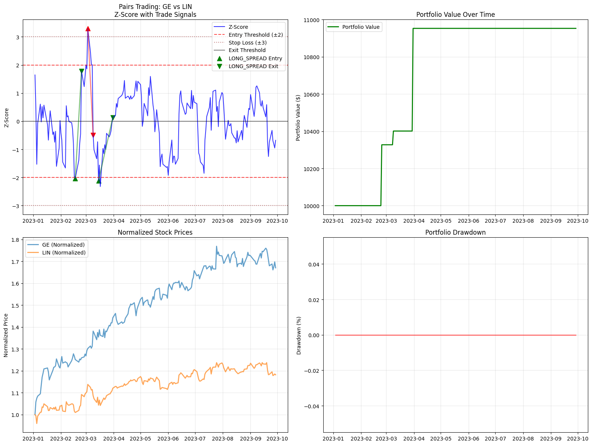
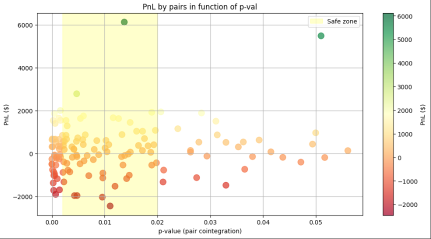

# Pairs Trading & Cointegration Screener

This repository explores a **pairs trading strategy** based on cointegration between US equities.  
The main focus is a **cointegration screener** that identifies potential trading pairs and evaluates their statistical relationships.

---

## Overview

Pairs trading is a **market-neutral strategy**: two historically correlated assets are traded when their spread diverges from the mean.  

This project includes:

- A **cointegration screener** for the S&P500 index to find statistically linked pairs.
- **Backtesting** of identified pairs using a mean-reversion strategy.
- **Forward testing** to check if past cointegration predicts future profits (example pair: `BAC / RF`).
- Analysis of **cumulative PnL, Sharpe ratios, and risk characteristics**.

> ⚠ Note: The strategy is for educational purposes and **not optimized for production trading**.

---
## Key Features

1. **Cointegration Screener**
   - Computes cointegration statistics across a universe of stocks.
   - Ranks pairs by p-value, correlation, and historical spread behavior.

2. **Backtesting All Pairs**
   - Simulates trades using z-score, entry/exit thresholds, and stop-loss.
   - Aggregates **cumulative PnL**, Sharpe ratio, and trade statistics across all pairs.

3. **Forward Testing (Year + 1)**
   - Checks if cointegration from a given year predicts trades in the following year.
   - `BAC / RF` is used as a **demonstrative example**, not the only pair.

4. **Rolling Capital Analysis**
   - Applies previous-year cointegration year by year.
   - Highlights capital evolution, drawdowns, and winning years.

5. **Visualization**
   - `backtest.png` – Example trade chart.
   - `cumul_pnl_pval.png` – Cumulative PnL vs p-value for all pairs.
   - `pnl_by_pair.png` – PnL distribution by pair.

---

## Example Results (Forward Test on `BAC / RF`)

- Final capital after 25 years: **$21,154.86**
- Average annual PnL: **$446.19**
- Average Sharpe ratio: **0.38**
- Winning years: **13 / 25**

> Modest profitability with drawdowns during crises. This is illustrative; the strategy is **not fully risk-neutral**.
> another strategy will be added later on with a focus on risk neutrality

  

---

## Next Steps

Future notebooks will explore:

- **Rolling windows** for dynamic cointegration.
- **Hedging techniques** to improve neutrality and reduce risk.
- Portfolio-level analysis of multiple pairs.

